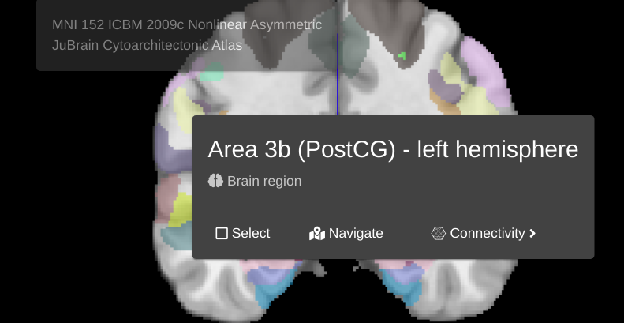
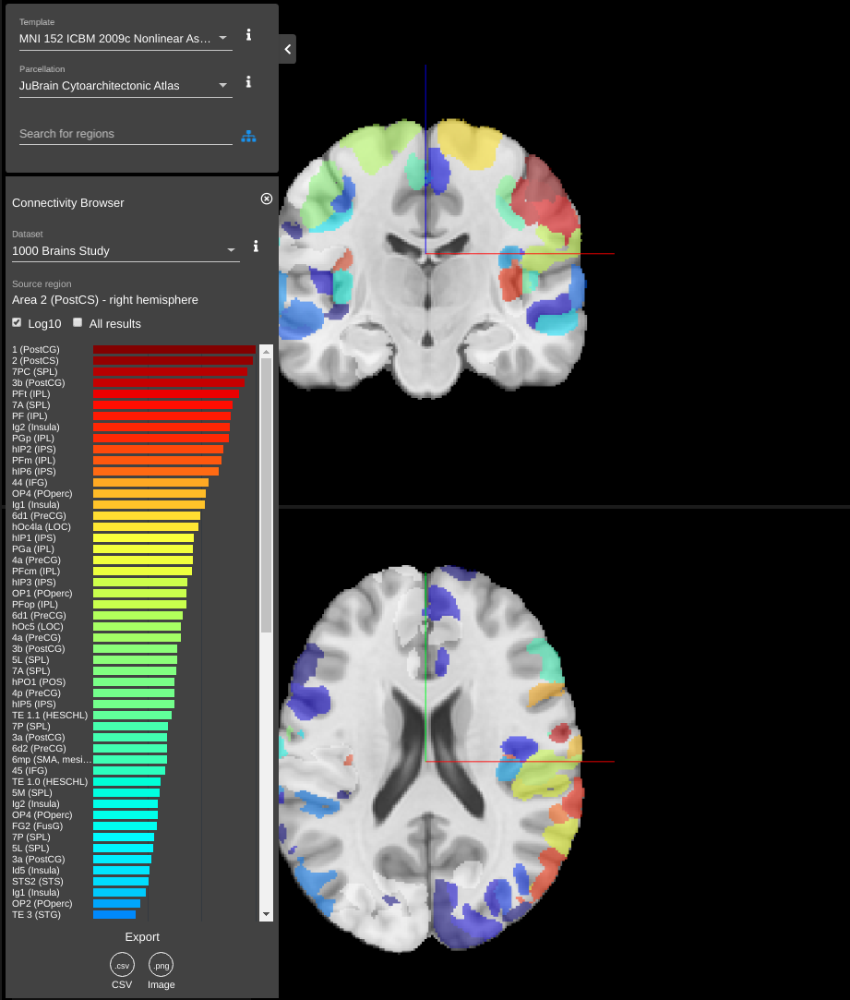
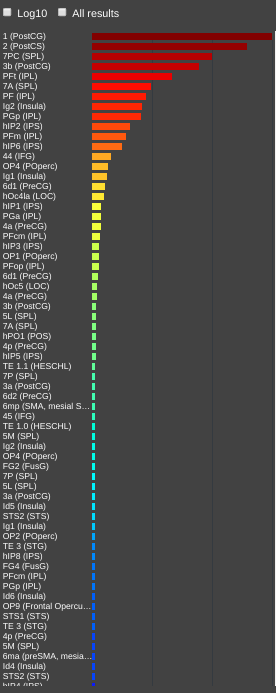
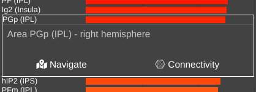

# Connectivity matrix

One of the new features from the Interactive Viewer's [version 2.1.0](https://interactive-viewer-user-documentation.apps.hbp.eu/releases/v2.1.0/) is to explore connectivity data, based on the parcellation area (region). Source of connectivity data is specific dataset(s) from HBP Knowledge Graph.

For now, connectivity data is explorable for parcellation: "JuBrain Cytoarchitectonic Atlas" which is available on "MNI Colin 27" and "ICBM 2009c Nonlinear Asymmetric" template spaces.

## Explore area connectivity
Select parcellation "JuBrain Cytoarchitectonic Atlas" and click on a region to bring up a context-specific menu

By clicking on the "Connectivity" button, available datasets for connectivity will be displayed

From the picture above, connectivity is available from the dataset "1000 Brain Study". Click on a dataset name to explore connectivity data and color visualization on the parcellation.
After selecting the desired dataset you can mention several changes:

1. Color map for parcellation regions will be changed by connectivity data. (The selected area is marked on the image below)
    
    - Color map before selecting connectivity
    
   
    
    - Color map after selecting connectivity
    
   

2. A Side panel will be opened (If it is closed) and connectivity data will be displayed

   

## Work with connectivity data
In the connectivity panel, under selected dataset, you can find the source region
    

### Explore/change dataset
From connectivity panel, you can change dataset or explore the description of the current dataset

   
   
Hover on (i) info icon to display dataset description

   
   
### Connected regions view
At the top of the connectivity diagram, you can see two checkboxes: "Log10" and "All results"
 
 1. "Log10" checkbox is to see a diagram with logarithmic data. (Log10 checkbox is checked by default)
 
  | Diagram with logarithmic data | Diagram without logarithmic data |
  |-------------------------------|----------------------------------|
  |     |  |

2. To see a number of connections on each connected region, the cursor should hover the desired area. 
"All results" checkbox, displays connection number of all connected areas at once (Checkbox is unchecked by default)
  
  | Diagram with disabled "All results" | Diagram with enabled "All results" |
  |-------------------------------|----------------------------------|
  |  |  |

By clicking the connected region, special panel will be expanded.

 
 
At the panel you can find a full name of the connected area and two buttons:
 "Navigate" - to change template navigation and move to region.
 "Connectivity" - to set region as source region and explore connectivity of it.

## Export connectivity data
At the end of the connectivity panel, you can find export buttons. 

   

You can export connectivity data with two options

1. Export data as a CSV file
2. Export data as "png" format image

## Close Connectivity
You can close connectivity from a close button on the top right side of the connectivity section at the right-side panel.

   

1. After clicking the close button, the standard parcellation region color map will be returned to the viewer. 
2. Connectivity data will be disappeared from a side panel