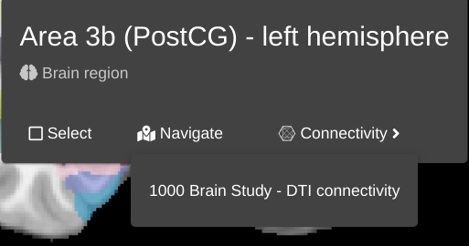
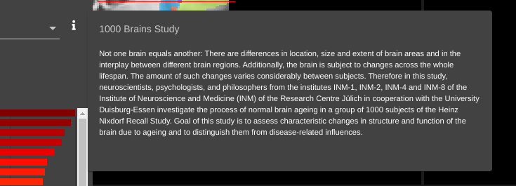
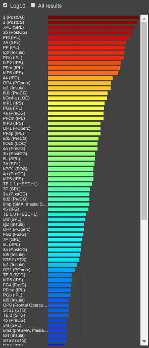
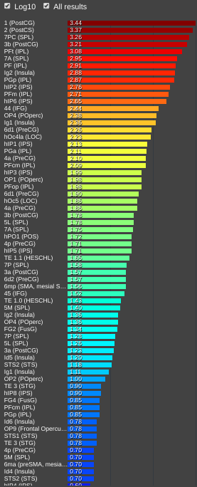
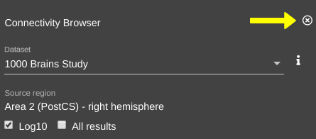

# Exploring connectivity

The interactive atlas viewer allows the exploration of connectivity of parcellation regions, based on datasets curated in HBP Knowledge Graph.

Currently, connectivity data is explorable for the parcellation `JuBrain Cytoarchitectonic Atlas`, which is available in template spaces `MNI Colin 27` and `ICBM 2009c Nonlinear Asymmetric`.

## Getting started

- Select parcellation `JuBrain Cytoarchitectonic Atlas` and click on a region to bring up a context-specific menu

   

- Click the `Connectivity` button, available datasets for connectivity will be displayed

   

- Click on a dataset (e.g. `1000 Brain Study - DTI connectivity`) to explore the connectivity data associated with it.

## Working with connectivity data

Upon selecting a preview dataset, several aspects of the UI will change:

- the color map of the parcellation will be replaced by a heat map, derived from the magnitutde of connectivity.

   | Regular color map | Connectivity heat map |
   | --- | --- |
   |  |  |
    

- a side panel will be opened, showing the tabulated data of the connectivity.

   

### Tabulated side panel

In the tabulated view, the selected dataset can be reviewed and changed.

The source region is displayed in the tabulated view.

The magnitude of the connectivity can either be displayed linearly or logarithmically by toggling the `Log10` checkbox.

| Connectivity plotted logarithmically `default` | Connectivity plotted linearly |
| --- | --- |
|  |  |

The display of magnitude of the connectivity can also be toggled with `All results` checkbox.

| Hiding magnitude `default` | Showing magnitude |
| --- | --- |
|  |  |

Clicking on any of the connected region will reveal a region context menu. In addition to the full name of the region, two buttons are present:

- `Navigate` - navigate to the region of interest.
- `Connectivity` - to the region of interest as the source, and explore its connectivity with other parcellation regions.

### Export

At the bottom of the side panel, `export` buttons can be found. The data can either be exported as a CSV or PNG.

## Exit

To exit the connectivity mode, click the close button located at the top right side of the side panel.

Exiting the connectivity mode will:

- restore the colour map of the parcellation 
- remove the connectivity side panel 
